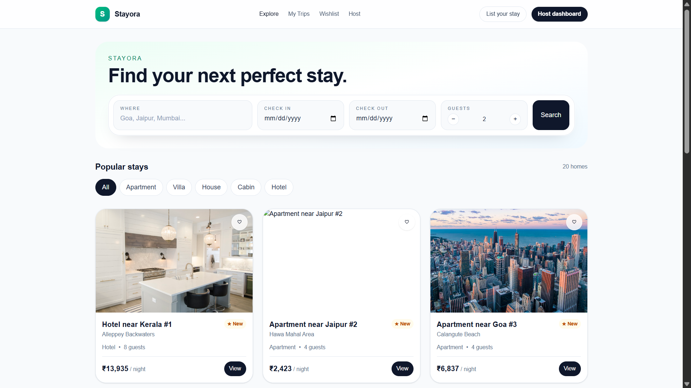
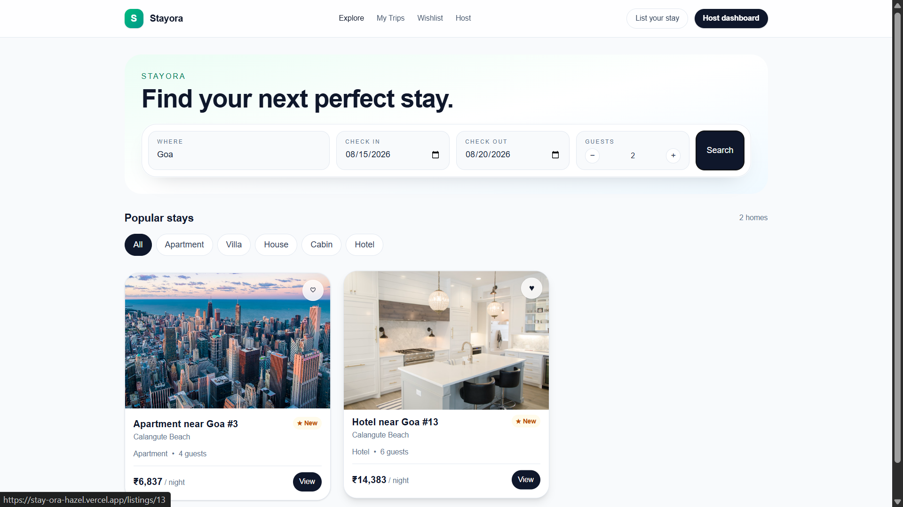

# Stayora 🏡

### Full-Stack Vacation Rental Marketplace

Stayora is a full-stack vacation-rental marketplace that enables users to discover properties, search and filter stays, view listing details, make bookings, manage trips, and manage properties as hosts.

The application is designed around a modern travel-marketplace experience with a clean, responsive interface and a REST-based backend architecture.

🔗 **Live Demo:** https://stay-ora-hazel.vercel.app
🔗 **GitHub:** https://github.com/Shresth2929/StayOra

---

## ✨ Features

### Guest Experience

* Browse vacation rental listings
* Search properties by location
* Filter by property type and price
* Filter based on guest capacity
* Paginated listing results
* View detailed property pages
* Property image galleries
* Amenities and property information
* Date selection
* Guest selection
* Availability validation
* Server-side price calculation
* Mock booking and checkout flow
* View bookings in **My Trips**
* Wishlist / favorite properties
* Reviews and ratings

### Host Experience

* Host dashboard
* View owned listings
* Create new listings
* Edit existing listings
* Delete listings
* View bookings for owned properties
* Host booking statistics
* Ownership validation for listing management

### UI / UX

* Modern vacation-rental marketplace design
* Responsive layout
* Reusable React components
* Search and filter interface
* Property cards
* Image galleries
* Booking summary
* Loading and error states
* Empty states
* Toast-style feedback
* Mobile-friendly layout

---

## 📸 Screenshots

### Home & Search



### Property Discovery



---

## 🛠️ Tech Stack

### Frontend

* Next.js
* React
* TypeScript
* Tailwind CSS

### Backend

* Python
* FastAPI
* Pydantic
* SQLAlchemy

### Database

* SQLite

### Development & Deployment

* Git
* GitHub
* Vercel
* Render

---

## 🏗️ Architecture

Stayora follows a client-server architecture.

```text
                    Stayora
                       │
          ┌────────────┴────────────┐
          │                         │
      Frontend                   Backend
      Next.js                   FastAPI
      TypeScript                   │
      Tailwind                     │
          │                         │
          └──────── REST API ───────┘
                                    │
                                  SQLite
```

The frontend communicates with the backend through REST APIs. Database operations are handled exclusively by the FastAPI backend.

---

## 📁 Project Structure

```text
StayOra/
│
├── backend/
│   ├── models/
│   ├── routers/
│   ├── schemas/
│   ├── services/
│   ├── database.py
│   ├── main.py
│   ├── seed.py
│   ├── requirements.txt
│   └── README.md
│
├── frontend/
│   ├── app/
│   ├── components/
│   ├── lib/
│   ├── public/
│   ├── package.json
│   └── README.md
│
├── .gitignore
└── README.md
```

---

## 🗄️ Database Design

The application uses SQLite with SQLAlchemy.

Main entities:

```text
User
 │
 ├── Listings
 ├── Bookings
 ├── Reviews
 └── Favorites

Listing
 │
 ├── Listing Images
 ├── Amenities
 ├── Bookings
 └── Reviews
```

### Main tables

| Table          | Purpose                      |
| -------------- | ---------------------------- |
| Users          | Guest and host information   |
| Listings       | Property details             |
| Listing Images | Property image URLs          |
| Amenities      | Available property amenities |
| Bookings       | Guest reservations           |
| Reviews        | Property ratings and reviews |
| Favorites      | Saved properties             |

---

## 🔌 REST API

### Listings

```http
GET    /api/listings
GET    /api/listings/{id}
POST   /api/listings
PUT    /api/listings/{id}
DELETE /api/listings/{id}
```

Listing search supports parameters such as:

```text
location
min_price
max_price
property_type
guests
amenities
page
limit
```

Example:

```http
GET /api/listings?location=Goa&guests=2&page=1&limit=12
```

### Bookings

```http
GET  /api/bookings
GET  /api/bookings/{id}
POST /api/bookings
```

Booking creation includes server-side:

* Date validation
* Availability checking
* Guest capacity validation
* Number-of-nights calculation
* Price calculation

### Host APIs

```http
GET /api/host/listings
GET /api/host/bookings
GET /api/host/stats
```

### Reviews

```http
GET  /api/listings/{listing_id}/reviews
POST /api/reviews
```

### Favorites

```http
GET    /api/favorites
POST   /api/favorites
DELETE /api/favorites/{listing_id}
```

---

## 📅 Booking Availability

A core part of the application is preventing overlapping reservations.

Before creating a booking, the backend checks existing confirmed bookings for the selected listing.

For example:

```text
Existing booking:
20 Aug ───────── 25 Aug

New booking:
22 Aug ─── 24 Aug

Result:
❌ Booking rejected
```

Whereas:

```text
Existing booking:
20 Aug ───────── 25 Aug

New booking:
26 Aug ─────── 29 Aug

Result:
✅ Booking allowed
```

Availability validation is performed on the backend rather than trusting the frontend.

---

## 💰 Price Calculation

The server calculates the final booking amount.

```text
Base Price = price_per_night × number_of_nights

Total Price =
Base Price
+ Cleaning Fee
+ Service Fee
```

The frontend does not have authority over the final stored booking amount.

---

## 🚀 Local Setup

### Clone the repository

```bash
git clone https://github.com/Shresth2929/StayOra.git
cd StayOra
```

---

### Backend Setup

```bash
cd backend
python -m venv .venv
```

Windows:

```bash
.venv\Scripts\activate
```

Install dependencies:

```bash
pip install -r requirements.txt
```

Seed the database:

```bash
python seed.py
```

Start FastAPI:

```bash
uvicorn main:app --reload --port 8000
```

Backend will be available at:

```text
http://localhost:8000
```

FastAPI documentation:

```text
http://localhost:8000/docs
```

---

### Frontend Setup

Open another terminal:

```bash
cd frontend
npm install
```

Create:

```text
.env.local
```

with:

```env
NEXT_PUBLIC_API_URL=http://localhost:8000
```

Start the development server:

```bash
npm run dev
```

Frontend will be available at:

```text
http://localhost:3000
```

---

## 🌐 Deployment

### Frontend

The Next.js frontend is deployed on:

**Vercel**

Live URL:

https://stay-ora-hazel.vercel.app

### Backend

The FastAPI backend is deployed on:

**Render**

Backend URL:

https://stayora-backend-0fds.onrender.com

The production frontend communicates with the deployed FastAPI backend using:

```env
NEXT_PUBLIC_API_URL
```

---

## 🔐 Mocked / Simplified Features

The following features are intentionally simplified or mocked for the application:

* Authentication / user identity
* Payment processing
* Guest-host messaging
* Real-time maps
* Identity verification

The application uses seeded users and mock guest/host identities for demonstration purposes.

Property images are provided through seeded public image URLs.

---

## 🎯 Design & Engineering Decisions

### Why Next.js?

Next.js provides a structured React application with routing, component-based development and production-ready frontend capabilities.

### Why FastAPI?

FastAPI provides a lightweight and efficient way to build REST APIs with automatic request validation and interactive API documentation.

### Why SQLite?

SQLite keeps the assignment simple and self-contained while still providing relational persistence for listings, users and bookings.

### Why REST APIs?

Separating the frontend from the backend makes the architecture modular and allows the API layer to be consumed by other clients in the future.

---

## 📌 Current Scope

Stayora focuses on the core functionality of a vacation-rental marketplace:

```text
Discover
   ↓
Search & Filter
   ↓
View Property
   ↓
Select Dates & Guests
   ↓
Check Availability
   ↓
Calculate Price
   ↓
Book
   ↓
View Trip
```

Hosts can independently manage:

```text
Create Listing
      ↓
Edit Listing
      ↓
Delete Listing
      ↓
View Bookings
```

---

## 🔮 Future Improvements

Potential production improvements include:

* JWT-based authentication
* Persistent cloud database such as PostgreSQL
* Cloud image storage
* Real payment gateway integration
* Real-time messaging
* Interactive maps
* Advanced search ranking
* Improved booking concurrency handling
* Automated unit and integration testing
* CI/CD pipeline

---

## 👨‍💻 Author

**Shresth Veer Singh**

GitHub:
https://github.com/Shresth2929

---

## 📄 License

This project was created as an original software engineering project for educational and evaluation purposes.
